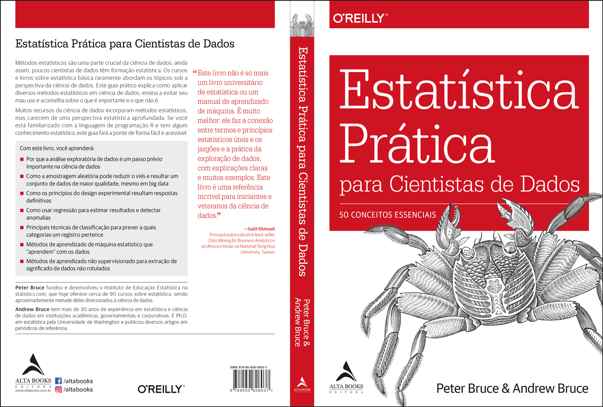

# book-statistics_for_data_science

Estudos sobre Estatística para Ciência de Dados através do livro "Estatística Prática" de Peter Bruce & Andrew Bruce (O'Reilly).

Copyright 2019 Starlin Alta Editora e Consultoria Eireli, 978-85-508-0603-7.

O site para compra do livro: [Amazon](https://www.amazon.com.br/Estat%C3%ADstica-Pr%C3%A1tica-Para-Cientistas-Dados/dp/855080603X/ref=sr_1_4?keywords=estat%C3%ADstica+pr%C3%A1tica+para+cientistas+de+dados&qid=1650050299&sprefix=estat%C3%ADstica+pr%C3%A1tica%2Caps%2C204&sr=8-4)

Todos os estudos foram baseados no livro citado.

## Conteúdos

1. Análise Exploratória de Dados
2. Distribuições de Dados e Amostras
3. Experimentos Estatísticos e Testes de Significância
4. Regressão e Previsão
5. Classificação
6. Aprendizado de Máquina Estatístico
7. Aprendizado Não Supervisionado
